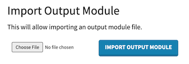

# Setup pumps as an output in mycodo

In Mycodo settings -> Custom Outputs: Import [the custom output pumps_pumpsx4.py](pump_pumpsx4.py)

After import the output can be used. Its name is `PumpsX4 Output [UART] `

## Initial setup

Set `Name` and `UART Device` and click `SAVE`

### Calibration
Preparation: Get a measurement cup

* Select `Pump number`
* Select the `Dispense amount` you want to dispense in your measurement cup during calibration
* Click `Start calibraion`
* The pump starts dispensing. 
* Watch your measurement cup
  * When the `Dispense Amount` you selected is reached / pumped into your measuremment cup click `Stop calibration`
* ✅Your pumps are ready to rumble.

* ⚠️You only need to do this calibration once per pump type (e.g. Steppers/Motors). All other steppers/motors take over the calibration result.

## Usage
* `Emergency stop` immediately stops and resets _all_ pumps.
* You can manually dispense by selecting `Pump number` and `Dispense amount` and then clicking the `Dispense Amount`-Button
* Four channels of type 'vol' / Volume are available in mycodo.